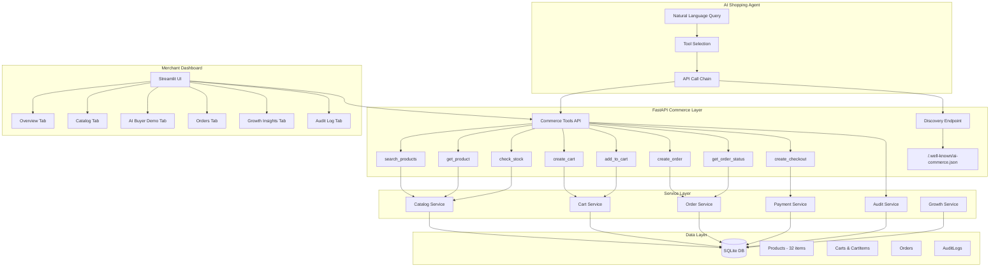
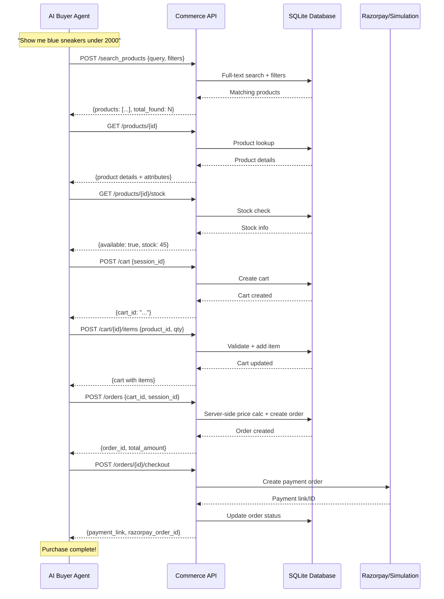
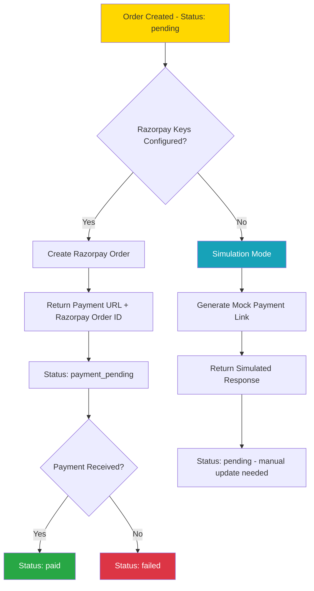
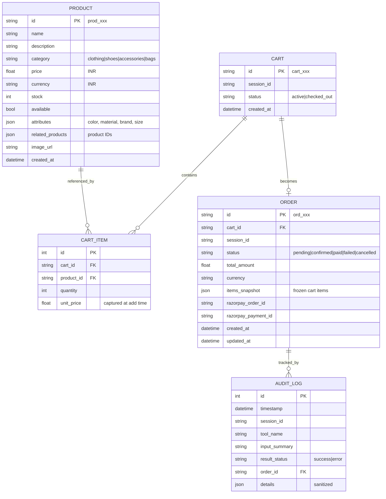
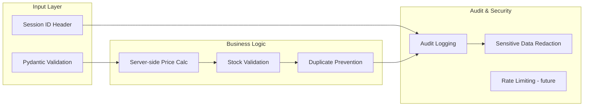

# Bharat Bazaar AI — Architecture

## System Architecture

```mermaid
graph TB
    subgraph "AI Shopping Agent"
        A[Natural Language Query] --> B[Tool Selection]
        B --> C[API Call Chain]
    end

    subgraph "FastAPI Commerce Layer"
        D[Discovery Endpoint] --> E["/.well-known/ai-commerce.json"]
        F[Commerce Tools API] --> G[search_products]
        F --> H[get_product]
        F --> I[check_stock]
        F --> J[create_cart]
        F --> K[add_to_cart]
        F --> L[create_order]
        F --> M[get_order_status]
        F --> N[create_checkout]
    end

    subgraph "Service Layer"
        O[Catalog Service]
        P[Cart Service]
        Q[Order Service]
        R[Payment Service]
        S[Audit Service]
        T[Growth Service]
    end

    subgraph "Data Layer"
        U[(SQLite DB)]
        V[Products - 32 items]
        W[Carts & CartItems]
        X[Orders]
        Y[AuditLogs]
    end

    subgraph "Merchant Dashboard"
        Z[Streamlit UI]
        Z1[Overview Tab]
        Z2[Catalog Tab]
        Z3[AI Buyer Demo Tab]
        Z4[Orders Tab]
        Z5[Growth Insights Tab]
        Z6[Audit Log Tab]
    end

    C --> F
    C --> D
    G --> O
    H --> O
    I --> O
    J --> P
    K --> P
    L --> Q
    M --> Q
    N --> R
    F --> S

    O --> U
    P --> U
    Q --> U
    R --> U
    S --> U
    T --> U

    Z --> Z1
    Z --> Z2
    Z --> Z3
    Z --> Z4
    Z --> Z5
    Z --> Z6
    Z --> F
```

---

## Agent Tool-Call Flow

```mermaid
sequenceDiagram
    participant Agent as AI Buyer Agent
    participant API as Commerce API
    participant DB as SQLite Database
    participant Pay as Razorpay/Simulation

    Note over Agent: "Show me blue sneakers under 2000"

    Agent->>API: POST /search_products {query, filters}
    API->>DB: Full-text search + filters
    DB-->>API: Matching products
    API-->>Agent: {products: [...], total_found: N}

    Agent->>API: GET /products/{id}
    API->>DB: Product lookup
    DB-->>API: Product details
    API-->>Agent: {product details + attributes}

    Agent->>API: GET /products/{id}/stock
    API->>DB: Stock check
    DB-->>API: Stock info
    API-->>Agent: {available: true, stock: 45}

    Agent->>API: POST /cart {session_id}
    API->>DB: Create cart
    DB-->>API: Cart created
    API-->>Agent: {cart_id: "..."}

    Agent->>API: POST /cart/{id}/items {product_id, qty}
    API->>DB: Validate + add item
    DB-->>API: Cart updated
    API-->>Agent: {cart with items}

    Agent->>API: POST /orders {cart_id, session_id}
    API->>DB: Server-side price calc + create order
    DB-->>API: Order created
    API-->>Agent: {order_id, total_amount}

    Agent->>API: POST /orders/{id}/checkout
    API->>Pay: Create payment order
    Pay-->>API: Payment link/ID
    API->>DB: Update order status
    API-->>Agent: {payment_link, razorpay_order_id}

    Note over Agent: Purchase complete!
```

---

## Payment Flow

```mermaid
flowchart TD
    A[Order Created - Status: pending] --> B{Razorpay Keys Configured?}
    
    B -->|Yes| C[Create Razorpay Order]
    C --> D[Return Payment URL + Razorpay Order ID]
    D --> E[Status: payment_pending]
    E --> F{Payment Received?}
    F -->|Yes| G[Status: paid]
    F -->|No| H[Status: failed]
    
    B -->|No| I[Simulation Mode]
    I --> J[Generate Mock Payment Link]
    J --> K[Return Simulated Response]
    K --> L[Status: pending - manual update needed]
    
    style A fill:#ffd700
    style G fill:#28a745,color:#fff
    style H fill:#dc3545,color:#fff
    style I fill:#17a2b8,color:#fff
```

---

## Data Model

```mermaid
erDiagram
    PRODUCT {
        string id PK "prod_xxx"
        string name
        string description
        string category "clothing|shoes|accessories|bags"
        float price "INR"
        string currency "INR"
        int stock
        bool available
        json attributes "color, material, brand, size"
        json related_products "product IDs"
        string image_url
        datetime created_at
    }

    CART {
        string id PK "cart_xxx"
        string session_id
        string status "active|checked_out"
        datetime created_at
    }

    CART_ITEM {
        int id PK
        string cart_id FK
        string product_id FK
        int quantity
        float unit_price "captured at add time"
    }

    ORDER {
        string id PK "ord_xxx"
        string cart_id FK
        string session_id
        string status "pending|confirmed|paid|failed|cancelled"
        float total_amount
        string currency
        json items_snapshot "frozen cart items"
        string razorpay_order_id
        string razorpay_payment_id
        datetime created_at
        datetime updated_at
    }

    AUDIT_LOG {
        int id PK
        datetime timestamp
        string session_id
        string tool_name
        string input_summary
        string result_status "success|error"
        string order_id FK
        json details "sanitized"
    }

    CART ||--o{ CART_ITEM : contains
    PRODUCT ||--o{ CART_ITEM : referenced_by
    CART ||--o| ORDER : becomes
    ORDER ||--o{ AUDIT_LOG : tracked_by
```

---

## Security Architecture

```mermaid
flowchart LR
    subgraph "Input Layer"
        A[Pydantic Validation]
        B[Session ID Header]
    end

    subgraph "Business Logic"
        C[Server-side Price Calc]
        D[Stock Validation]
        E[Duplicate Prevention]
    end

    subgraph "Audit & Security"
        F[Audit Logging]
        G[Sensitive Data Redaction]
        H[Rate Limiting - future]
    end

    A --> C
    B --> F
    C --> D
    D --> E
    E --> F
    F --> G
```
